<h1 align="center">Smart Island</h1>

<p align="center">
  A lightweight, privacy-first Android overlay that turns notifications, calls, media playback, battery states, timers, stopwatches, and system activities into a floating glanceable Dynamic Island.
</p>

<p align="center">
  <strong>Current release: v7.0.0</strong>
</p>

<p align="center">
  
  
  
  
  
  <a href="https://www.virustotal.com/gui/file/c07da408e7fa3e3fdeb25ec6415af07f1d56eff099840221138e9364c6065102/details" target="_blank">
    
  </a>
</p>

<p align="center">
  <a href="#downloads--safety">Downloads</a> |
  <a href="#screenshots">Screenshots</a> |
  <a href="#features">Features</a> |
  <a href="#gesture-guide">Gesture Guide</a> |
  <a href="#getting-started">Getting Started</a> |
  <a href="#privacy-and-permissions">Privacy</a> |
  <a href="ROADMAP.md">Roadmap</a> |
  <a href="CHANGELOG.md">Changelog</a> |
  <a href="https://telegram.me/SmartIslandApp">Telegram Community</a>
</p>

---

## Overview

Smart Island is an open-source Android application that renders a fluid, dynamic floating pill near your device's camera notch or status bar. It intercepts system notifications, live activities, media playback, calls, charging events, hotspot connections, navigation instructions, timers, stopwatches, and battery alerts locally—expanding into rich interactive cards with zero cloud tracking.

The project is designed to be 100% transparent, hackable, and privacy-conscious: all notification processing and history storage are strictly on-device, preferences are stored in local DataStore, and network access is solely opt-in for in-app release checks.

---

## Downloads & Safety

* **Download APK**: Obtain the pre-compiled APK directly from the [GitHub Releases (v7.0.0)](https://github.com/agupta07505/SmartIsland/releases/latest) page.
* **Total Downloads**: 
* **Telegram Channel**: Join our active community at [telegram.me/SmartIslandApp](https://telegram.me/SmartIslandApp) to suggest features, get support, and discuss updates.
* **Security Verification**: To ensure complete safety, inspect packages via [VirusTotal](https://www.virustotal.com/gui/file/c07da408e7fa3e3fdeb25ec6415af07f1d56eff099840221138e9364c6065102/details) or review automatic GitHub Actions CI builds.

---

## Screenshots

<p align="center">
  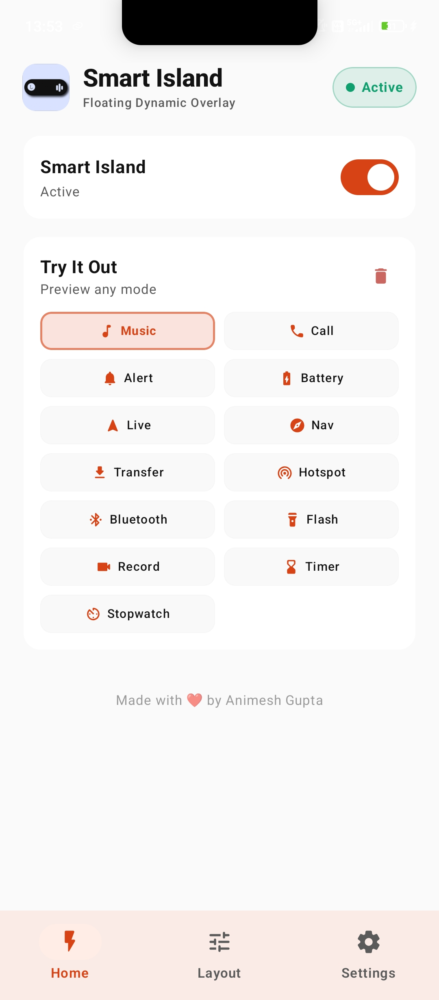
  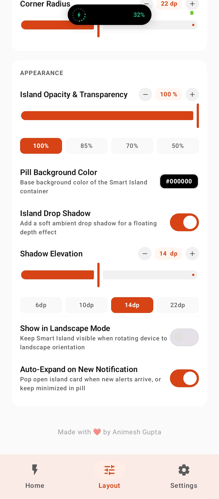
  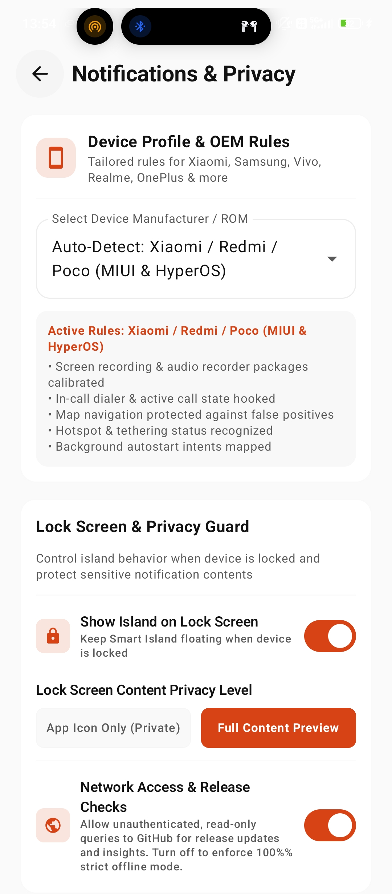
  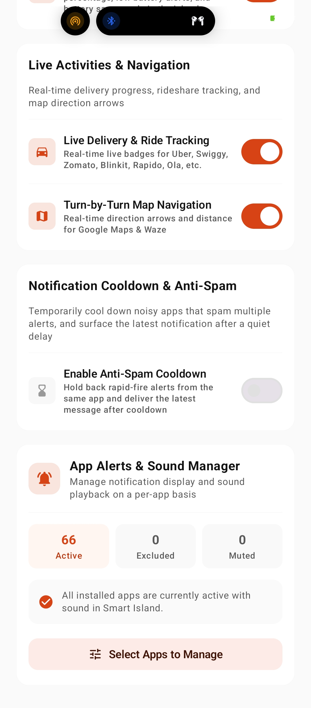
</p>

<p align="center">
  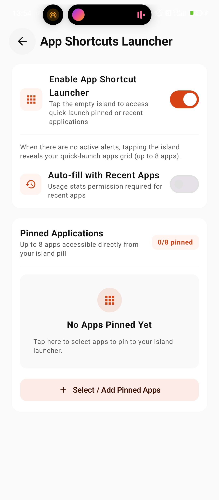
  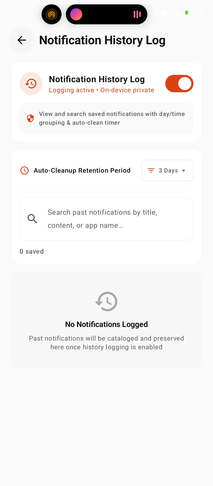
  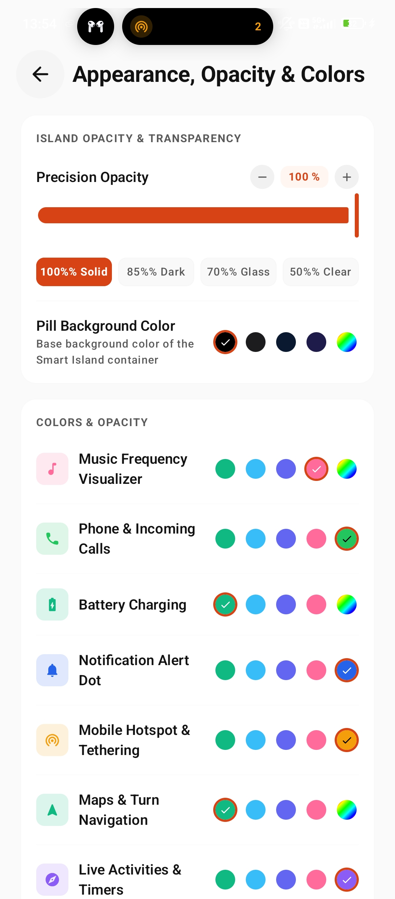
  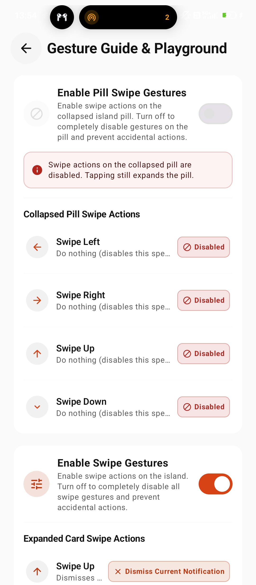
</p>

<p align="center">
  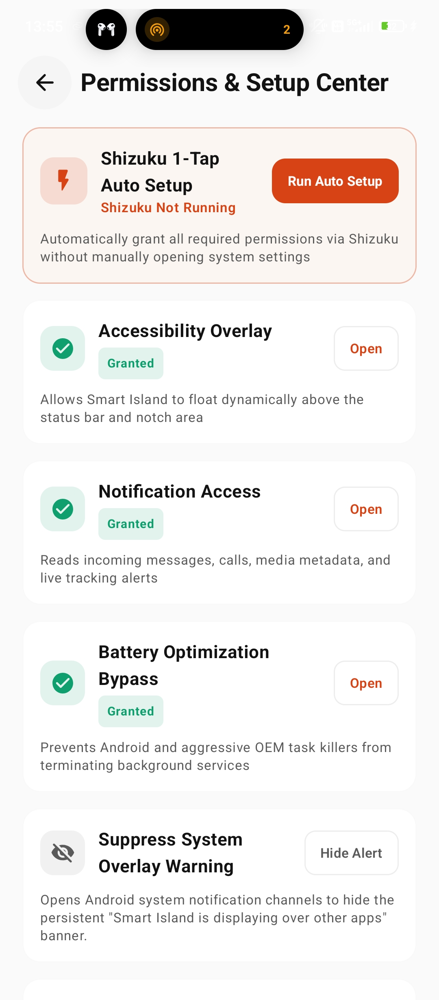
  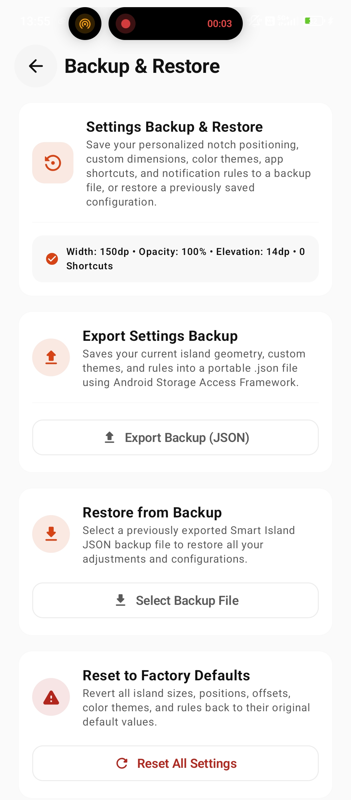
  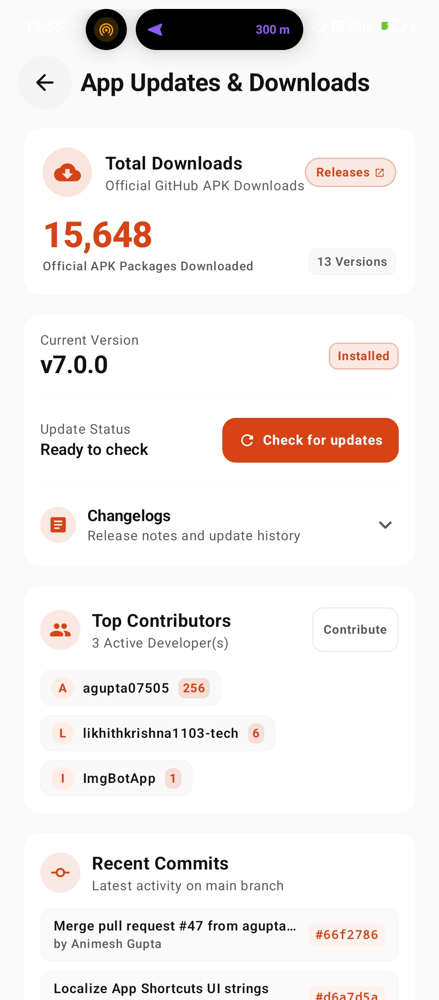
  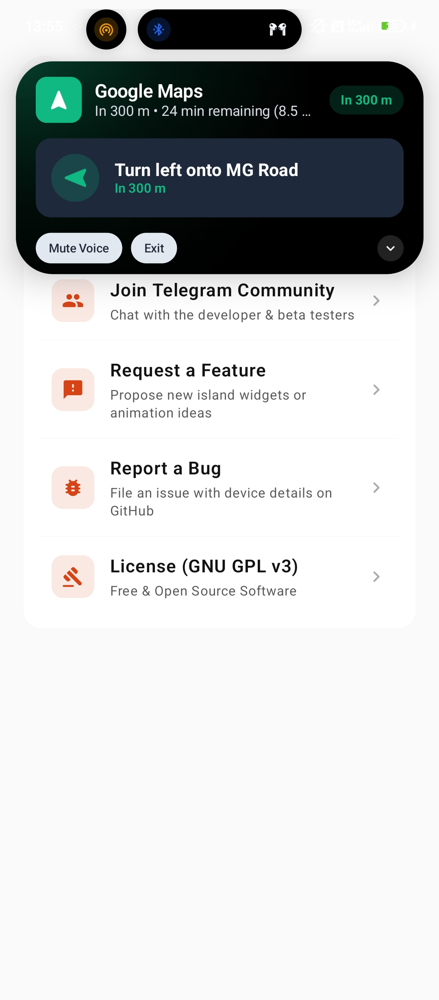
</p>

<p align="center">
  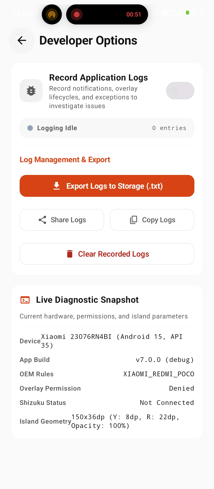
</p>

---

## Features

| Feature Area | Capabilities & Details |
| --- | --- |
| **Deep Burnt-Orange (#D84315) Design System** | Harmonious curated color palette with rich burnt-orange accents, deep slate/black card surfaces, crisp typography, and unified tinted Material icons throughout all settings cards and switches. |
| **App Updates & Downloads Hub** | Dedicated section showcasing Total Downloads counter (15,648+), Current Version line (v7.0.0), 1-tap GitHub update checker, in-app changelogs viewer, Top Contributors gallery, and Recent Commits feed. |
| **In-Pill Swipe Gestures & Media Controls** | Swiping horizontally across the compact pill skips tracks (`skipToNext`/`skipToPrevious`) or cycles notifications without expanding the island. Features master toggle, swipe direction pickers, and individual disable controls. |
| **Selective App Alerts & Sound Manager** | Fast selective app configuration modal with search bar, per-app alert toggles, custom ringtone sound toggling, and island exclusion without heavy upfront package loading. |
| **Configurable Companion Circle Position** | Place the multi-tasking companion circle on either the **Left** or **Right** of the pill with anti-overlap geometry clamping for corner and punch-hole displays. |
| **Material 3 Expressive UI** | Modern MD3 color tokens, dynamic wallpaper color adaptation (Android 12+), rounded shapes, and fluid physics. |
| **Ultra-Fluid Spring Physics** | iOS-grade synchronized spring curves (`stiffness = 520f`, `dampingRatio = 0.72f`), snappy 190ms cross-fades, organic companion bubble pops, and tactile button bounce. |
| **Tap Anywhere to Open App** | Tapping anywhere on expanded notification and music cards outside interactive buttons launches the source app and collapses the island. |
| **Auto-Hide Pill Inactivity Timer** | Automatically hides the pill and companion bubble after a customizable inactivity timeout (1s to 60s with 1-tap presets), with tap-to-awaken gesture. |
| **Landscape Mode Control** | User toggle to keep Smart Island visible in landscape orientation with automated screen width repositioning, or auto-hide for distraction-free gaming and video. |
| **Bluetooth Battery & Earbuds Animation** | Dual-path battery level extraction via broadcast extra and reflection, with a smooth 3-second spring-animated transition between live battery gauge and earbuds icon. |
| **Notification Cooldown & Anti-Spam** | Intelligent burst detection (e.g. 3 alerts in 30s) that temporarily cools down noisy apps, holding rapid spam and surfacing the latest message after a customizable quiet period (1–30 min), with per-app whitelist exclusion. |
| **Island Opacity & Transparency** | Continuous background opacity slider (20% to 100%) with 4 quick 1-tap presets (Solid, Dark, Glass, Clear) and ambient drop shadow rendering. |
| **Inline Reply & IME Focus** | Direct text reply input right inside the expanded Island notification card with dynamic WindowManager focus switching, soft keyboard integration, and `RemoteInput` dispatch. |
| **Timer & Stopwatch Modes** | Intelligent clock notification parsing for Google Clock, Samsung Clock, MIUI/HyperOS, ColorOS, and Huawei Clock. Collapsed countdown/elapsed badges, expanded circular/linear timer progress, live millisecond stopwatch ticker, and interactive pause/resume/lap/reset controls. |
| **Virtualized Notification History** | Ultra-smooth `LazyColumn` virtualized SQLite history log with background `AppIconMemoryCache`, search bar, app filter chips, full message inspection dialog, and bulk **Delete by App** support. |
| **OEM Device Rules Engine** | Tailored background protection and autostart management for Xiaomi/HyperOS, Samsung OneUI, OnePlus/Oppo/Realme (ColorOS/OxygenOS), Huawei/Honor, Vivo/iQOO, and Asus to prevent aggressive background kills. |
| **Full-Color App Icons** | Extracted launcher icons with LRU caching for crisp, authentic app icons in both collapsed pill and expanded cards. |
| **Battery Modes (Low & Saver)** | Dynamic Battery island displaying Green for Charging, Pulsing Red for Low Battery (&le; 20%), and Warm Amber for Battery Saver ON with live battery percentage badge. |
| **Comprehensive Gesture Engine** | Dual-tier gesture system: In-Pill Swipes (Left/Right/Up/Down for media/notifications) and Expanded Card Gestures (Tap, Dismiss, 300ms Hold + Swipe Clear All, Floating Window, Notification Shade). |
| **Split Island Multi-State** | Secondary auxiliary bubble for concurrent background activities (e.g. Music + Hotspot, Call + Bluetooth, Timer + Music). |
| **Wavy Music Player** | Real-time audio waveform scrubber, ambient album artwork background glow, track metadata, and dynamic color customization. |
| **Message Sync Suppression** | Automatically filters background message polling notifications (e.g. Snapchat, WhatsApp sync) to prevent download mode hijacking. |
| **Live Activity Tracking** | Real-time delivery and rideshare tracking (Uber, Swiggy, Zomato, Blinkit, Rapido, Ola) with brand colors. |
| **Turn-by-Turn Navigation** | Live turn navigation indicators, maneuver direction arrows, remaining distance, and ETA. |
| **Download & Upload Progress** | Real-time transfer speed meters (MB/s), progress bars, and animated icons. |
| **Wi-Fi Hotspot Monitor** | Live tethering client counter, SSID badge, data usage, and quick turn-off action. |
| **Flashlight & Screen Recording** | Active torch toggle card and live screen recording timer overlay. |
| **App Shortcuts Launcher** | Quick-launch grid with up to 8 pinned apps or auto-filled recent applications, with complete user enable/disable control. |
| **Custom RGB Color Studio** | Fine-grained Red, Green, Blue slider color picker with live Hex preview for all 13 dynamic modes. |
| **Notch & Layout Presets** | Instant 1-tap calibration for Center Hole, Wide Island, Left Corner, Right Corner, and Compact Pill. |
| **Precision Sizing Controls** | Millimeter-accurate sliders for Width, Height, X Offset, Y Offset, Corner Radius, and Drop Shadows. |
| **Shizuku 1-Tap Auto Setup** | Automated permission grants for Restricted Settings, Usage Access, Overlay, and Battery Optimization. |
| **Backup & Restore System** | Export and restore complete island notch coordinates, dimensions, custom color themes, app shortcuts, and rules to/from JSON via Android Storage Access Framework with bounds validation. |
| **iPhone Notch Mode** | Top-edge docked notch styling, rounded bottom corners, and complete elimination of the secondary right companion circle for an authentic iPhone notch experience. |
| **Developer Mode & Log Recording** | 7-tap version unlock, in-memory diagnostic buffer, process logcat extraction, live status badges, and 1-tap `.txt` report export via Storage Access Framework. |
| **Lock Screen Privacy Guard** | Opt-in lock screen display with customizable sensitive content hiding (App Icon Only vs Full Preview). |

---

## 13 Dynamic Island Modes

Smart Island intelligently categorizes and presents live activities into 13 dedicated modes:

1. **Notification**: Standard incoming app alerts with full-color launcher icons, action buttons, and **Inline Reply**.
2. **Timer**: Live countdown timer with circular/linear progress indicator and pause/resume/stop controls.
3. **Stopwatch**: Live elapsed millisecond ticker with lap tracking and pause/reset controls.
4. **Music**: Media playback with interactive wavy seek bar, ambient album art glow, and repeat/like toggles.
5. **IncomingCall**: Active call timer, caller badge, and waveform animations.
6. **Battery**: Charging speed & time-until-full, low battery pulsing alerts (&le; 20%), and battery saver mode.
7. **LiveActivity**: Delivery and ride-sharing updates (Uber, Zomato, Swiggy, Blinkit, Rapido, Ola) with brand accents.
8. **Navigation**: Turn-by-turn routing indicators, maneuver direction arrows, remaining distance, and ETA.
9. **DownloadUpload**: Real-time download and upload progress bars with MB/s transfer speed meters.
10. **Hotspot**: Tethering status, connected device client counter, and 1-tap toggle.
11. **Bluetooth**: Connected device battery percentage, dual-path battery level extraction, and smooth alternating spring animation between battery gauge and earbuds icon.
12. **Flashlight**: Active torch status indicator with 1-tap shutoff.
13. **ScreenRecording**: Live recording elapsed duration timer.

---

## Gesture Guide

Smart Island provides dual-tier gesture control covering both the compact collapsed pill and the expanded card:

### Collapsed Pill Gestures
| Gesture on Pill | Default Action | Available Custom Actions |
|---|---|---|
| **Swipe Left** | **Previous Notification** | Next Notification, Previous Track (`skipToPrevious`), Next Track (`skipToNext`), Play/Pause, Dismiss Current, Open App, Floating Window, Notification Shade, **Disabled** |
| **Swipe Right** | **Next Notification** | Previous Notification, Next Track (`skipToNext`), Previous Track (`skipToPrevious`), Play/Pause, Dismiss Current, Open App, Floating Window, Notification Shade, **Disabled** |
| **Swipe Up** | **Dismiss Current** | Dismiss All Notifications, Open Notification Shade, **Disabled** |
| **Swipe Down** | **Expand Island** | Open Notification Shade, Open App, Floating Window, Dismiss Current, **Disabled** |
| **Single Tap** | **Expand Island** | Opens full interactive card (or awakens pill when idle-hidden) |

### Expanded Card Gestures
| Gesture on Card | Action | Description & Feedback |
|---|---|---|
| **Single Tap** | **Open Source App** | Tapping neutral card areas opens the underlying application; tapping outside collapses the card |
| **Quick Swipe Up** | **Dismiss Current** | Flick upward (&ge; 48dp) to dismiss active notification from stack |
| **Hold + Swipe Up** | **Clear ALL Notifications** | Press & hold for **300ms** until **haptic vibration pulse**, then swipe up to dismiss all pending notifications |
| **Swipe Down** | **Floating Window / Shade** | Drag downward (&ge; 48dp) to launch app in freeform floating window or open notification shade |
| **Swipe Left / Right** | **Switch Stack / Tracks** | Navigate smoothly between notifications, timers, and active media sessions |

---

## Architecture

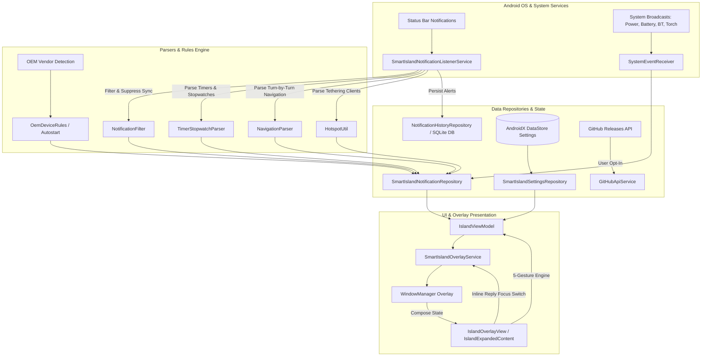

---

## Tech Stack

| Layer | Technology |
| --- | --- |
| **Language** | Kotlin 2.0+ (JVM Target 17) |
| **UI Framework** | Jetpack Compose & Material 3 Expressive Design System |
| **Architecture** | Clean Architecture, MVI/Repository Pattern |
| **Dependency Injection** | Dagger Hilt |
| **State & Async** | Kotlin Coroutines, StateFlow, Atomic Mutex |
| **Local Persistence** | AndroidX DataStore Preferences & SQLite (`NotificationHistoryDbHelper`) |
| **System Services** | NotificationListenerService, Accessibility Floating Service, WindowManager Overlays, Shizuku |
| **Network & Updates** | In-app GitHub Release API via `GitHubApiService` (strictly opt-in via `allowNetworkChecks`) |
| **Build & CI** | Gradle Wrapper, AGP 9.0+, GitHub Actions CI (@v4) |

---

## Requirements

- **Android Version**: Android 8.0+ (API 26 through API 36)
- **JDK**: Java Development Kit 17
- **Permissions**: Overlay (`SYSTEM_ALERT_WINDOW`) and Notification Listener access

---

## Getting Started

### 1. Clone the repository
```bash
git clone https://github.com/agupta07505/SmartIsland.git
cd SmartIsland
```

### 2. Build the debug APK
**On Windows:**
```powershell
.\gradlew.bat assembleDebug
```

**On macOS / Linux:**
```bash
./gradlew assembleDebug
```

### 3. Install on a connected device
```bash
adb install -r app/build/outputs/apk/debug/app-debug.apk
adb shell am start -n com.agupta07505.smartisland/.MainActivity
```

---

## Privacy And Permissions

Smart Island is strictly privacy-first:

| Permission | Purpose |
| --- | --- |
| `SYSTEM_ALERT_WINDOW` | Draws the floating dynamic island overlay above other applications. |
| `BIND_NOTIFICATION_LISTENER_SERVICE` | Intercepts notification metadata to display alerts, media playback, timers, and system states. |
| `FOREGROUND_SERVICE` & `SPECIAL_USE` | Keeps the overlay service active in the background without being killed by the OS. |
| `ACCESS_RESTRICTED_SETTINGS` (Optional Shizuku) | Grants 1-tap automated permissions without manual menu navigation. |
| `INTERNET` (Opt-in) | Used **strictly** for user-opted GitHub release update checks (`allowNetworkChecks`). **Zero** notification data, metadata, or telemetry is ever transmitted over the network. |

*Note: All notification processing and notification history are stored 100% locally on-device. See [PRIVACY.md](PRIVACY.md).*

---

## Contributing

Contributions are warmly welcomed! Please read [CONTRIBUTING.md](CONTRIBUTING.md) before submitting pull requests, and use our issue templates for bug reports or feature suggestions.

---

## License

Smart Island is licensed under the [GNU General Public License v3.0](LICENSE).  
Copyright (C) 2026 **Animesh Gupta**.

