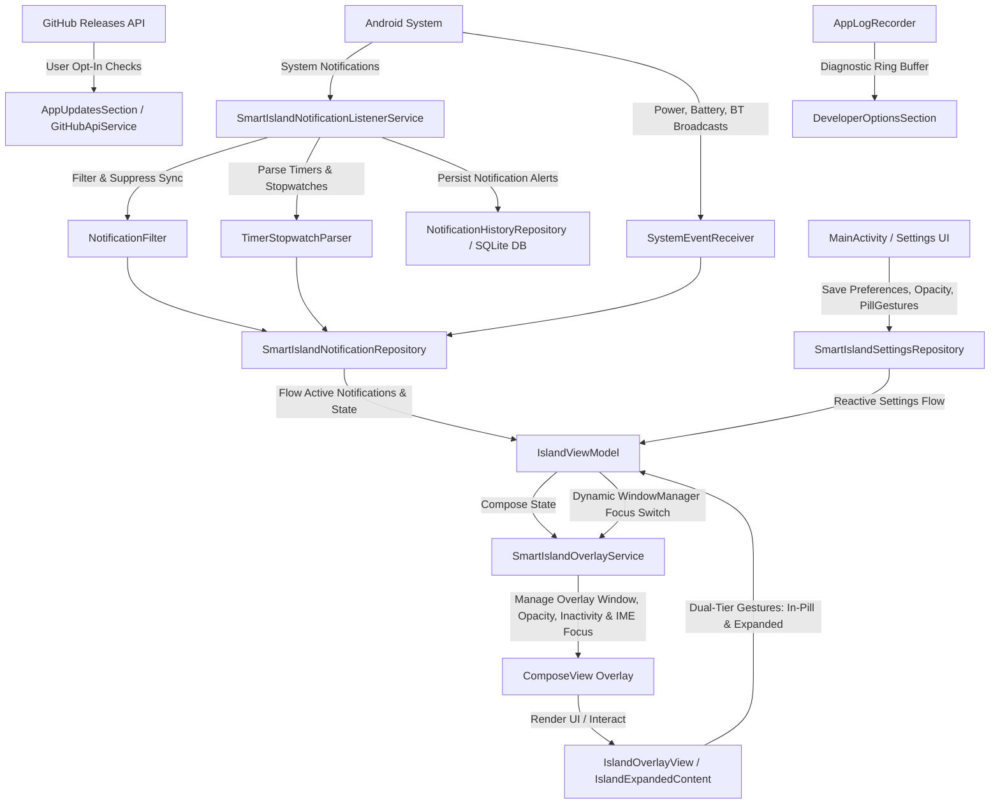

# Smart Island Application Analysis

This document provides a comprehensive, deep-dive analysis of the **Smart Island** Android application (reflecting the **v7.0.0** baseline). It acts as the ultimate reference point for the application's architecture, components, features, and implementation details.

---

## 1. Architectural Overview

The **Smart Island** app is an Android application built using **Jetpack Compose** that mimics the iOS "Dynamic Island" feature. It intercepts incoming system notifications, clock states (timers/stopwatches), system events, and media playback, displaying them in a highly animated, interactive overlay pill floating at the top of the screen.

---

## 2. Core Service Components

### 2.1. `SmartIslandNotificationListenerService`
* **File:** [SmartIslandNotificationListenerService.kt](file:///a:/SmartIsland/app/src/main/java/com/agupta07505/smartisland/service/SmartIslandNotificationListenerService.kt)
* **Purpose:** A system-bound service that listens to incoming status bar notifications.
* **Key Mechanisms:**
  * **Heads-Up Notification Interception:** Checks if the notification importance is `IMPORTANCE_HIGH` (Heads-Up). If it is, the service **cancels the notification in the system tray** (`cancelNotification(sbn.key)`) to suppress the default system heads-up banner, and forwards the event to `SmartIslandOverlayService` with `autoExpand = true`.
  * **System Notification Dismissal Sync:** Tracks suppressed keys inside `suppressedKeys` to ensure self-cancelled notifications are not removed from the overlay state during the suppression process.
  * **Clock Notification Parsing (`TimerStopwatchParser`):** Automatically decodes clock alerts (Google Clock, Samsung Clock, MIUI/HyperOS, ColorOS, Huawei) into dedicated `IslandMode.Timer` or `IslandMode.Stopwatch` states.
  * **Virtualized SQLite Notification History Tracking:** Records incoming notifications locally in the `NotificationHistoryRepository` with background LRU icon caching and throttled pruning for post-alert search, filtering, and bulk app deletion.
  * **Full-Color App Launcher Icons:** Loads original full-color application launcher icons via `packageManager.getApplicationIcon` with LRU bitmap caching.
  * **Notification Classification (`toIslandMode`):** Determines the category to display:
    * `Notification.CATEGORY_CALL` / `Notification.CATEGORY_MISSED_CALL` &rarr; `IslandMode.IncomingCall`
    * `Notification.CATEGORY_TRANSPORT` / `Notification.CATEGORY_PROGRESS` or action labels containing media keywords &rarr; `IslandMode.Music`
    * Clocks matching timer/stopwatch patterns &rarr; `IslandMode.Timer` / `IslandMode.Stopwatch`
    * Otherwise &rarr; `IslandMode.Notification`
  * **Media Info Extraction:** Retrieves playback info (duration, position, play/pause state, album art) via the `MediaSession.Token` attached to the notification or from active system media controllers.

### 2.2. `SmartIslandOverlayService`
* **File:** [SmartIslandOverlayService.kt](file:///a:/SmartIsland/app/src/main/java/com/agupta07505/smartisland/service/SmartIslandOverlayService.kt)
* **Purpose:** A foreground service that manages the window overlay lifecycle and renders the floating Dynamic Island UI using Jetpack Compose.
* **Key Mechanisms:**
  * **Window Overlay Creation:** Inflates a custom `ComposeView` into the `WindowManager` using the `TYPE_APPLICATION_OVERLAY` flag.
  * **Touch Pass-Through (Crucial Workaround):** 
    * To prevent the transparent overlay window from blocking user interactions with apps behind it, the service implements a reflection-based `OnComputeInternalInsetsListener`.
    * **Collapsed State:** Insets are set to `3` (`TOUCHABLE_INSETS_REGION`). It dynamically calculates the bounding box of the small collapsed pill (centered at the top, translated by `yOffset`) and maps it to `touchableRegion`/`mTouchableRegion` inside `InternalInsetsInfo` across different OEM ROMs. Touch events outside this boundary pass directly to background apps.
    * **Expanded State:** Insets are set to `0` (`TOUCHABLE_INSETS_FRAME`), letting the overlay window capture touches across the entire screen so that taps outside the expanded card can trigger a collapse animation.
  * **Dynamic Soft-Keyboard (IME) Focus Switching:**
    * When typing an **Inline Reply**, dynamically switches window flags from `FLAG_NOT_FOCUSABLE` to `FLAG_ALT_FOCUSABLE_IM` with `SOFT_INPUT_ADJUST_PAN` / `RESIZE`.
    * Restores non-focusable touch pass-through when keyboard closes or reply completes.
  * **Auto-Collapse Timer:** Automatically collapses the expanded state back to a pill after 5 seconds of inactivity (paused while typing an inline reply via `isInputActive`).
  * **Landscape Mode Control:** Automatically respects `showInLandscape` preference to either hide the island or dynamically adjust metrics and coordinates when rotated.
  * **Instant Collapse Window Debouncing:** Truncated collapse delay from 500ms to 220ms for instant touch restoration to underlying applications.
  * **Background Activity Launch (Android 14+):** Configures `PendingIntent` execution with background activity start permissions to ensure seamless launching of target apps from overlays.
  * **Freeform Window Launching:** Enables notifications to be opened in a floating window (Freeform Mode) by setting the launch windowing mode to `5` (`WINDOWING_MODE_FREEFORM`) and calculating coordinates to position it center-screen.

### 2.3. `SystemEventReceiver`
* **File:** [SystemEventReceiver.kt](file:///a:/SmartIsland/app/src/main/java/com/agupta07505/smartisland/service/SystemEventReceiver.kt)
* **Purpose:** A broadcast receiver listening for power connection status and battery state changes.
* **Key Mechanisms:**
  * **Charging Detection:** Registers for `ACTION_POWER_CONNECTED` to post a battery charging notification with `autoExpand = true` and `ACTION_POWER_DISCONNECTED` to clear the battery state.
  * **Battery Level Updates:** Observes `ACTION_BATTERY_CHANGED` to retrieve battery level percentage and updates the repository state silently (`autoExpand = false`) to deduplicate unchanged percentages and avoid unnecessary auto-expand animations.

### 2.4. `OverlayViewTreeOwners`
* **File:** [OverlayViewTreeOwners.kt](file:///a:/SmartIsland/app/src/main/java/com/agupta07505/smartisland/service/OverlayViewTreeOwners.kt)
* **Purpose:** Provides custom implementations of `LifecycleOwner`, `ViewModelStoreOwner`, and `SavedStateRegistryOwner` for the overlay view tree.
* **Why it's needed:** Because the Compose overlay resides in a background Service rather than an Activity, Compose views need these owners explicitly attached to prevent runtime crashes (e.g. during animations or recompositions that access ViewModel or SavedState context).

---

## 3. Data & Settings Management

### 3.1. `SmartIslandSettings`
* **File:** [SmartIslandSettings.kt](file:///a:/SmartIsland/app/src/main/java/com/agupta07505/smartisland/data/SmartIslandSettings.kt)
* **Parameters:**
  * `enabled` (Boolean): Controls service lifecycle.
  * `width` (Float): Collapsed width of the pill (Default: `112f`).
  * `height` (Float): Collapsed height of the pill (Default: `34f`).
  * `xOffset` (Float): Horizontal adjustment (Default: `0f`).
  * `yOffset` (Float): Vertical adjustment relative to status bar (Default: `12f`).
  * `cornerRadius` (Float): Corner rounding (Default: `22f`).
  * `autoHidePill` (Boolean): Automatic hiding after inactivity (Default: `false`).
  * `autoHideTimeoutSeconds` (Int): Inactivity duration (Default: `5s`).
  * `showInLandscape` (Boolean): Overlay visibility in landscape orientation (Default: `false`).

### 3.2. `SmartIslandSettingsRepository`
* **File:** [SmartIslandSettingsRepository.kt](file:///a:/SmartIsland/app/src/main/java/com/agupta07505/smartisland/data/SmartIslandSettingsRepository.kt)
* **Purpose:** Uses Android Jetpack `DataStore` (Preferences) to persist the values reactively. It exposes a Kotlin Coroutines `Flow<SmartIslandSettings>` that is collected inside the service to reposition/resize the window.

---

## 4. UI Components

### 4.1. `SmartIslandHomeScreen`
* **File:** [SmartIslandHomeScreen.kt](file:///a:/SmartIsland/app/src/main/java/com/agupta07505/smartisland/ui/SmartIslandHomeScreen.kt)
* **Purpose:** The main settings screen of the app. It manages:
  * Master toggles for the overlay service.
  * Permission cards with deep links to system settings for:
    1. **System Alert Window** (`Settings.ACTION_MANAGE_OVERLAY_PERMISSION`) - Required to draw above apps.
    2. **Notification Listener** (`Settings.ACTION_NOTIFICATION_LISTENER_SETTINGS`) - Required to intercept notifications.
    3. **Hide Overlay System Warning** (`Settings.ACTION_APP_NOTIFICATION_SETTINGS`) - Shortcut to disable the persistent system overlay alert.
  * **Sliders:** Adjusts pill size, location (X/Y offsets), corner radius, and auto-hide inactivity timeout.
  * **Demo Buttons:** Triggers simulated alerts (`Notify`, `Call`, `Music`) inside the overlay.
  * **Gesture Guide:** Displays a dedicated tabbed tutorial screen (`GesturesSection.kt`) with looping finger path overlays and Try-It-Yourself gesture play sandboxes.

### 4.2. `IslandOverlayView`
* **File:** [IslandOverlayView.kt](file:///a:/SmartIsland/app/src/main/java/com/agupta07505/smartisland/ui/IslandOverlayView.kt)
* **Purpose:** The core Compose layout container for the Dynamic Island.
* **Key Features:**
  * **Ultra-Fluid Spring Physics:** Synchronized width and height transitions using Compose's `updateTransition` with calibrated spring physics (`dampingRatio = 0.72f`, `stiffness = 520f`) and 190ms alpha cross-fades.
  * **Notification Stack Indicator:** If `notifications.size > 1` when collapsed, it draws elegant concentric black arcs (`drawArc`) behind the left/right sides of the pill, visually signifying a stack of items.
  * **Auto-Hide & Tap-to-Awaken:** Shrinks pill to 0 size when inactive for `autoHideTimeoutSeconds`; displays an invisible touch target allowing 1-tap awaken and 2-tap expand.
  * **Dual-Tier Gesture Controls:**
    * **In-Pill Swipe Actions (Collapsed State):**
      * **Swipe Left / Right:** Cycles active notifications or triggers media track skip (`skipToNext`/`skipToPrevious`) on Spotify, YouTube Music, podcasts, or system media players without expanding the island.
      * **Swipe Up:** Dismisses current notification, dismisses all, or opens notification shade.
      * **Swipe Down:** Expands island, opens notification shade, launches app, or opens floating window.
      * **Tap:** Expands into full interactive card (or awakens pill when idle-hidden).
      * **Master & Directional Controls:** Master toggle `enablePillSwipeActions` and individual directional action selectors with `SwipeAction.None` (Disabled) support.
    * **Expanded Card Gestures:**
      * **Tap Neutral Background:** Opens target app directly and collapses card.
      * **Tap Outside:** Collapses expanded island.
      * **Quick Swipe Up (Vertical Drag < -35dp):** Dismisses and clears active notification from stack.
      * **Hold + Swipe Up (300ms haptic):** Dismisses all active notifications simultaneously.
      * **Swipe Down (Vertical Drag > 35dp):** Launches app in Freeform/Floating window mode or opens notification shade.
      * **Swipe Left/Right (Horizontal Drag):** Swipes pages between multiple active notifications or media tracks in stack.

### 4.3. `IslandCollapsedContent`
* **File:** [IslandCollapsedContent.kt](file:///a:/SmartIsland/app/src/main/java/com/agupta07505/smartisland/ui/IslandCollapsedContent.kt)
* **Purpose:** Manages the visual elements when the pill is collapsed.
* **Structure:**
  * **Left Slot:** App Icon / Contact Icon / Music album art.
  * **Right Slot:** Contextual indicators:
    * Notification: Blue dot.
    * Call: Active call timer displaying elapsed duration in `MM:SS` format (green text).
    * Music: Live 3-bar Audio Visualizer animation powered by GPU-accelerated Compose `graphicsLayer` scaling.
    * Battery: Pulsing charging battery icon (infinite scale transition) next to the charging percentage text.
    * Bluetooth: Alternating spring animation (3s cadence) between live battery gauge and earbuds icon.

### 4.4. `IslandExpandedContent`
* **File:** [IslandExpandedContent.kt](file:///a:/SmartIsland/app/src/main/java/com/agupta07505/smartisland/ui/expanded/IslandExpandedContent.kt)
* **Purpose:** Displays the full interactive dialog when expanded.
* **Key Features:**
  * **HorizontalPager:** Allows user to swipe left/right to browse multiple incoming notifications.
  * **Tap-to-Open Target App:** Neutral taps on expanded cards trigger application launch.
  * **Dynamic Height Measurement:** Measures each pager page using `onSizeChanged` and interpolates heights dynamically during scroll/swipe gestures to ensure smooth size transitions. Height cache (`pageHeights`) is keyed on unique notification keys rather than page indices, preventing height-jumping bugs when notifications update or change categories.
  * **State Layouts:**
    1. **Notification:** Shows title, description, time, custom actions, **Inline Reply** input field, and a button to open the full app.
    2. **Incoming Call:** Large caller name and green/red answer/reject circular buttons.
    3. **Music:** Large album art, song/artist text, media control buttons (Previous, Play/Pause, Next), and a progress slider that estimates track position locally in a coroutine loop to avoid lag.
    4. **Battery:** A custom battery charging visual progress layout featuring a circular status indicator with flowing multicolor gradients, dynamic charging time remaining estimates, and large charging percentage display.

### 4.5. `AppUpdatesSection`
* **File:** [AppUpdatesSection.kt](file:///a:/SmartIsland/app/src/main/java/com/agupta07505/smartisland/ui/sections/AppUpdatesSection.kt)
* **Purpose:** Dedicated hub for application downloads and version releases.
* **Key Features:**
  * **Total Downloads Metric:** Prominently highlights total downloads counter (15,648+) at the top.
  * **Clean Horizontal Hierarchy:** Current Version badge (v7.0.0), Check for updates button, and in-app Changelogs viewer modal.
  * **Top Contributors:** Fetches top GitHub contributors with avatar thumbnails and commit stats.
  * **Recent Commits:** Displays latest Git commits log directly from repository.

### 4.6. `DeveloperOptionsSection` & `AppLogRecorder`
* **Files:** [DeveloperOptionsSection.kt](file:///a:/SmartIsland/app/src/main/java/com/agupta07505/smartisland/ui/sections/DeveloperOptionsSection.kt), [AppLogRecorder.kt](file:///a:/SmartIsland/app/src/main/java/com/agupta07505/smartisland/util/AppLogRecorder.kt)
* **Key Features:**
  * **7-Tap Unlock:** Unlocked by tapping the App Version in About section 7 times.
  * **In-Memory Ring Buffer:** Captures up to 3,000 log events with zero disk writes during normal operation.
  * **Process Logcat & Diagnostics:** Captures process logcat trace and hardware/ROM snapshot.
  * **SAF Text Export:** One-tap export to `.txt` file via Android Storage Access Framework.

### 4.7. `BackupRestoreSection`
* **File:** [BackupRestoreSection.kt](file:///a:/SmartIsland/app/src/main/java/com/agupta07505/smartisland/ui/sections/BackupRestoreSection.kt)
* **Key Features:**
  * **JSON Export:** Scoped Storage export of all 40+ user preferences and geometry configs.
  * **JSON Import & Validation:** Atomic single-transaction restore with bounds validation.
  * **Factory Reset:** Safe reset with confirmation dialog.

### 4.8. Custom Modifiers
* **`bounceClick`:** ([BounceClick.kt](file:///a:/SmartIsland/app/src/main/java/com/agupta07505/smartisland/ui/BounceClick.kt)) Animates button scale down to `0.90f` on press and rebounds with high-frequency tactile spring physics (`dampingRatio = MediumBouncy`, `stiffness = StiffnessMedium`) upon release.

---

## 5. Summary of Main Operations

| Action | Process Flow |
| :--- | :--- |
| **New High-Priority Notification** | Intercepted &rarr; Cancelled in system tray &rarr; Displayed in overlay &rarr; Pill expands &rarr; 5s auto-collapse timer starts. |
| **In-Pill Swipe Left/Right** | Drag detected on compact pill &rarr; Evaluates `PillSwipeAction` &rarr; Dispatches media skip (`skipToNext`/`skipToPrevious`) or cycles active notification. |
| **Swiping Down on Expanded** | Triggered in `IslandOverlayView` &rarr; Service sets window bounds &rarr; Intent launched with freeform window bundle &rarr; App opens in floating window (or shade). |
| **Swiping Up on Expanded** | Triggered in `IslandOverlayView` &rarr; Notification removed from state &rarr; System notification dismissed via listener service. |
| **Swiping Left/Right on Expanded** | Triggered in `IslandOverlayView` &rarr; Pager page scrolls &rarr; Active page index updates &rarr; Height interpolates dynamically to match next notification key. |
| **Tap collapsed Pill** | Expanding transition starts &rarr; Height recalculates to fit expanded content &rarr; Full details/controls exposed. |

---

## 6. Support & Feedback Section (Main Screen)

Located in [SmartIslandHomeScreen.kt](file:///a:/SmartIsland/app/src/main/java/com/agupta07505/smartisland/ui/SmartIslandHomeScreen.kt) right above the About section, this card handles options for user contribution and app reviews:

* **Star on GitHub**: Opens the main repository URL (`https://github.com/agupta07505/SmartIsland`) to allow starring. Uses `Icons.Rounded.Star`.
* **Request a Feature**: Opens the GitHub issues page with preconfigured query parameters for a new enhancement request. Uses `Icons.Rounded.Feedback`.
* **Report a Bug**: Opens the GitHub issues page preconfigured for a new bug report. Uses `Icons.Rounded.BugReport`.
* **App Review**: Attempts to launch the Play Store review interface using `market://details?id=...` with a browser backup. Uses `Icons.Rounded.RateReview`.
* **Licence**: Directs users to the open-source license file on GitHub. Uses `Icons.Rounded.Gavel`.

---

## 7. About & Contact Information (Main Screen Bottom)

Located at the bottom of the scrollable layout in [SmartIslandHomeScreen.kt](file:///a:/SmartIsland/app/src/main/java/com/agupta07505/smartisland/ui/SmartIslandHomeScreen.kt), this card displays app metadata, links, and contact buttons:

* **App Metadata & Options**:
  * **Version**: Dynamically queries the app package manifest information using `PackageManager` (reflecting the `versionName` defined in [build.gradle.kts](file:///a:/SmartIsland/app/build.gradle.kts)) with `Icons.Rounded.Info`.
  * **Privacy Policy**: Opens target URL (`PRIVACY.md` link) in a browser.
  * **Terms of Use**: Opens target URL (`TERMS.md` link) in a browser.
  * **Open Source**: Opens main GitHub codebase URL.
* **Developer Contact Details**:
  * **GitHub**: Launches `https://github.com/agupta07505` with a custom Canvas path.
  * **LinkedIn**: Launches `https://linkedin.com/in/agupta07505` with a custom Canvas background and overlaid text.
  * **Instagram**: Launches `https://instagram.com/agupta07505` with custom Canvas drawing.
  * **Email**: Launches `mailto:agupta07505@gmail.com` with custom Canvas envelope drawing.
* **Footer Signature**: Centered text at the very bottom displaying *"Made with ❤️ by Animesh Gupta"*.

