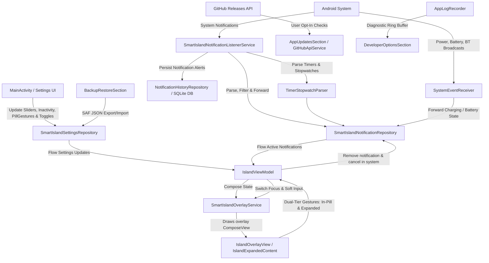

# Smart Island - Codebase & Architecture Analysis

This document presents a comprehensive, technical deep-dive into the architecture, design, and implementation of the **Smart Island** Android application (reflecting the **v7.0.0** baseline).

---

## 1. System Architecture

The application is structured around a reactive, unidirectional data flow (UDF) that links Android system events (notifications, battery state changes, clock timers/stopwatches) to a persistent Jetpack Compose overlay window drawn over other applications.

### Architectural Diagram

---

## 2. Core Service Components & Key Mechanisms

### 2.1. Notification Listener & Classification
* **Class:** [SmartIslandNotificationListenerService](file:///a:/SmartIsland/app/src/main/java/com/agupta07505/smartisland/service/SmartIslandNotificationListenerService.kt)
* **Mechanism:**
  * **System Interception:** Intercepts incoming notifications by extending Android's `NotificationListenerService`.
  * **System Tray Suppression:** If an incoming notification is classified as `IMPORTANCE_HIGH` (Heads-Up notification), the service calls `cancelNotification(sbn.key)` to suppress the default OS banner. Simultaneously, it posts the notification to the Smart Island overlay with `autoExpand = true` to mimic a heads-up animation.
  * **Suppressed Keys Set:** Maintains a local `suppressedKeys` set to handle the cancellation sync so that notifications are not accidentally removed from the overlay state during the self-cancellation process.
  * **Clock Parsing (`TimerStopwatchParser`):** Automatically decodes clock alerts (Google Clock, Samsung Clock, Xiaomi/HyperOS, ColorOS, Huawei) into dedicated `IslandMode.Timer` or `IslandMode.Stopwatch` states.
  * **Intelligent Notification Cooldown & Anti-Spam (`NotificationCooldownManager`):** Monitors notification bursts using a 30-second sliding window. Throttles apps exceeding the spam threshold, buffers the latest alert, and releases it cleanly after the quiet cooldown period.
  * **Persistent SQLite Notification Storage:** Stores notification alerts into the local SQLite database via [NotificationHistoryRepository](file:///a:/SmartIsland/app/src/main/java/com/agupta07505/smartisland/data/NotificationHistoryRepository.kt) for in-app history search, category filtering, and audit.
  * **Classification Logic:** Uses [NotificationFilter](file:///a:/SmartIsland/app/src/main/java/com/agupta07505/smartisland/util/NotificationFilter.kt) to filter out system-level package alerts, empty notifications, message sync background polling, and ongoing foreground tasks (unless they represent calls, music playback, progress tasks, or active timers). Categorizes notifications into one of the 13 `IslandMode` categories:
    * `Notification.CallStyle` / `Notification.CATEGORY_CALL` $\rightarrow$ `IslandMode.IncomingCall`
    * `Notification.CATEGORY_TRANSPORT` or notifications with media controllers/action labels $\rightarrow$ `IslandMode.Music`
    * Active timers & countdowns $\rightarrow$ `IslandMode.Timer`
    * Active stopwatch elapsed tickers $\rightarrow$ `IslandMode.Stopwatch`
    * Turn-by-turn navigation alerts $\rightarrow$ `IslandMode.Navigation`
    * Delivery & ride tracking $\rightarrow$ `IslandMode.LiveActivity`
    * Ongoing progress $\rightarrow$ `IslandMode.DownloadUpload`
    * Charging / battery alert $\rightarrow$ `IslandMode.Battery`
    * General notifications with Inline Reply $\rightarrow$ `IslandMode.Notification`
  * **Media Session Binding:** Inspects the notification extras for `Notification.EXTRA_MEDIA_SESSION`. If found, it establishes a `MediaController` connection to track play/pause states, position estimation, and metadata (title, artist, album artwork).

### 2.2. Compose Overlay Lifecycle & IME Focus Management
* **Class:** [SmartIslandOverlayService](file:///a:/SmartIsland/app/src/main/java/com/agupta07505/smartisland/service/SmartIslandOverlayService.kt)
* **Mechanism:**
  * **Application Overlay Window:** Inflates and manages a custom `ComposeView` drawn on the window manager using the `TYPE_APPLICATION_OVERLAY` flag.
  * **Dynamic Soft-Keyboard Focus Switching:** Dynamically flips WindowManager flags between `FLAG_NOT_FOCUSABLE` (for standard touch pass-through to background apps) and `FLAG_ALT_FOCUSABLE_IM` (to accept direct keyboard input during **Inline Reply** without locking up the OS).
  * **Landscape Mode Handling:** Dynamically adapts overlay positioning during screen rotation or auto-hides based on `showInLandscape` setting.
  * **Overlay View Tree Owners:** Attaches custom Lifecycle, ViewModel, and SavedStateRegistry owners defined in [OverlayViewTreeOwners](file:///a:/SmartIsland/app/src/main/java/com/agupta07505/smartisland/service/OverlayViewTreeOwners.kt) directly to the window-hosted `ComposeView`. This enables Jetpack Compose components and animations to run safely within the Service context without throwing standard runtime Activity missing context exceptions.

### 2.3. Touch Pass-Through & Reflection Workaround
The overlay window must not block touch events directed at underlying background apps (e.g. scrolling in Chrome, typing on a keyboard) when the island is collapsed.
* **Mechanism:**
  * **Frame vs. Region Insets:**
    * **Expanded State:** The layout params are updated to allow touch capturing across the full frame (`TOUCHABLE_INSETS_FRAME`) so that tapping outside the expanded island collapses the island.
    * **Collapsed State:** Uses `TOUCHABLE_INSETS_REGION` (integer value `3`). It registers a reflection-based `OnComputeInternalInsetsListener` on the `ViewTreeObserver` of the window.
  * **Region Boundary Calculation:** When collapsed, it dynamically reads the bounding box of the small floating pill:
    $$w = (\text{width} + 16) \times \text{density}$$
    $$h = (\text{height} + 16) \times \text{density}$$
    $$\text{left} = \frac{\text{screenWidth} - w}{2} + \text{xOffsetPx}$$
    $$\text{right} = \text{left} + w$$
    $$\text{top} = 0, \quad \text{bottom} = h$$
  * **ROM Compatibility:** Sets the computed bounding box into the `touchableRegion` (or `mTouchableRegion` via reflection to support customized OEM ROMs like MIUI/ColorOS) inside `InternalInsetsInfo`. Events outside this region pass directly to apps below.

### 2.4. Freeform Window & Background Intents (Android 14+)
Swiping down on an expanded notification opens its origin app in a floating window (Freeform Multi-Window Mode).
* **Mechanism:**
  * **Freeform mode launching:** Resolves the notification's `contentIntent`. It specifies the windowing mode parameter `5` (`WINDOWING_MODE_FREEFORM`) within the launch options bundle.
  * **Launch Bounds Configuration:** Configures a rectangular boundary centered on the screen:
    $$\text{w} = \text{screenWidth} \times 0.90, \quad \text{h} = \text{screenHeight} \times 0.65$$
  * **Android 14+ Background Privilege:** Sets `MODE_BACKGROUND_ACTIVITY_START_ALLOWED` via `ActivityOptions.setPendingIntentBackgroundActivityStartMode()` to bypass Android 14's strict background activity launching restrictions.

---

## 3. Reactive Data & State Management

State is persisted and exposed reactively using a repository pattern:

* **[SmartIslandSettingsRepository](file:///a:/SmartIsland/app/src/main/java/com/agupta07505/smartisland/data/SmartIslandSettingsRepository.kt):** Uses Android Jetpack `DataStore` (Preferences) to persist user configurations (X/Y offsets, sizes, colors, enabled status, auto-hide duration, landscape visibility). Exposes a reactive `Flow<SmartIslandSettings>`, with atomic single-transaction `restoreSettings(settings)` and `resetAllSettings()` support for JSON backup/restore via Android SAF.
* **[SmartIslandNotificationRepository](file:///a:/SmartIsland/app/src/main/java/com/agupta07505/smartisland/data/SmartIslandNotificationRepository.kt):** Holds active notifications in a thread-safe `MutableStateFlow<List<IslandNotification>>`. It receives posting/removal commands from services, synchronizing state with the UI.

---

## 4. UI Architecture & Custom Components

The UI is built with custom-themed Jetpack Compose components. It implements high-fidelity spring animations and custom graphics rendering:

### 4.1. Gestural Interactions & Animation Flow
The [IslandOverlayView](file:///a:/SmartIsland/app/src/main/java/com/agupta07505/smartisland/ui/IslandOverlayView.kt) implements dual-tier touch interceptors:
* **Collapsed Pill Gestures:**
  * **Swipe Left / Right:** Cycles through active notifications or triggers media track skips (`skipToNext`/`skipToPrevious`) without expanding.
  * **Swipe Up / Down:** Configurable to dismiss notification, expand island, or open notification shade.
  * **Tap:** Expands into the full interactive Smart Island card (or awakens pill when idle-hidden).
  * **Master Toggle:** `enablePillSwipeActions` can disable pill gestures completely to keep the pill tap-only.
* **Expanded Card Gestures:**
  * **Tap Neutral Expanded Background:** Opens the target application directly and collapses the card.
  * **Tap Outside:** Triggers the collapse animation of the expanded island.
  * **Swipe Up (Drag $< -35\text{dp}$):** Dismisses and clears the active notification.
  * **Hold + Swipe Up (300ms haptic):** Dismisses all notifications simultaneously.
  * **Swipe Down (Drag $> 35\text{dp}$):** Closes the island and launches target application in freeform window mode or opens notification shade.
  * **Swipe Left/Right:** Swipes pages between multiple active notifications/media tracks.
* **Stack Indicator:** When more than 1 notification is active, the collapsed island draws concentric black arcs (`drawArc`) behind the left and right sides of the pill, visually indicating a stack of items.

### 4.2. Collapsed Visual Indicators
The [IslandCollapsedContent](file:///a:/SmartIsland/app/src/main/java/com/agupta07505/smartisland/ui/IslandCollapsedContent.kt) contains slots tailored to the active mode:
* **Left Slot:** Displays the app icon, caller contact picture, or media album art.
* **Right Slot:** Contains dynamic indicators:
  * **Notification Mode:** A customizable blue notification dot.
  * **Call Mode:** An active timer (`CallTimer`) that updates elapsed time in `MM:SS` format.
  * **Music Mode:** A live 3-bar Audio Visualizer animation powered by GPU-accelerated Compose `graphicsLayer` scaling.
  * **Bluetooth Mode:** Dual-path battery gauge smoothly alternating with earbuds icon via 520f spring animation (`BluetoothCollapsedRight`).
  * **Battery Mode:** A custom battery percent text displaying next to the charging glyph.

### 4.3. Custom Graphics
* **Dotted Battery Ring:** ([DottedRing](file:///a:/SmartIsland/app/src/main/java/com/agupta07505/smartisland/ui/components/DottedRing.kt)) A custom-drawn circular charging indicator. It uses infinite rotation and scale animations on the central bolt icon inside a custom dotted progress path.
* **Wavy Seek Bar:** ([WavyMusicSeekBar](file:///a:/SmartIsland/app/src/main/java/com/agupta07505/smartisland/ui/WavyMusicSeekBar.kt)) A custom music progress bar displaying a sine wave pattern that animates dynamically when music is playing.
* **Click Bounce:** ([BounceClick](file:///a:/SmartIsland/app/src/main/java/com/agupta07505/smartisland/ui/BounceClick.kt)) A custom modifier that scales buttons down to `0.90f` on press and rebounds with high-frequency tactile spring physics (`dampingRatio = MediumBouncy`, `stiffness = StiffnessMedium`).

---

## 5. Settings Screen Layout

The [SmartIslandHomeScreen](file:///a:/SmartIsland/app/src/main/java/com/agupta07505/smartisland/ui/SmartIslandHomeScreen.kt) is split into modular components adhering to the **Unified Deep Burnt-Orange (#D84315) Design System**:

* **[HeaderSection](file:///a:/SmartIsland/app/src/main/java/com/agupta07505/smartisland/ui/sections/HeaderSection.kt):** Displays the app logo, tagline, and the master overlay switch.
* **[PermissionsSection](file:///a:/SmartIsland/app/src/main/java/com/agupta07505/smartisland/ui/sections/PermissionsSection.kt):** Displays alert cards showing whether system overlay drawing, notification listener access, and system overlay warnings are enabled.
* **[PositionsSection](file:///a:/SmartIsland/app/src/main/java/com/agupta07505/smartisland/ui/sections/PositionsSection.kt):** Contains sliders to live-update the pill's width, height, corner radius, X-offset, Y-offset, companion circle placement (Left vs Right), and iPhone Notch Mode docking.
* **[NotificationsAndPrivacySection](file:///a:/SmartIsland/app/src/main/java/com/agupta07505/smartisland/ui/sections/NotificationsAndPrivacySection.kt):** Houses OEM device rules, anti-spam notification cooldown, and the on-demand **Selective App Alerts & Sound Manager** modal.
* **[CustomizationsSection](file:///a:/SmartIsland/app/src/main/java/com/agupta07505/smartisland/ui/sections/CustomizationsSection.kt):** Houses preset color palettes and a custom RGB color picker dialog for all 13 modes, opacity sliders, and custom shadow elevation.
* **[AppShortcutsSection](file:///a:/SmartIsland/app/src/main/java/com/agupta07505/smartisland/ui/sections/AppShortcutsSection.kt):** Provides quick-launch shortcut config with enable/disable master control and up to 8 pinned/recent apps.
* **[GesturesSection](file:///a:/SmartIsland/app/src/main/java/com/agupta07505/smartisland/ui/sections/GesturesSection.kt):** Implements dual settings cards for **Collapsed Pill Swipe Actions** and **Expanded Card Swipe Actions**, with interactive playground sandbox.
* **[BackupRestoreSection](file:///a:/SmartIsland/app/src/main/java/com/agupta07505/smartisland/ui/sections/BackupRestoreSection.kt):** Scoped Storage JSON backup and restore via Android SAF with atomic single-transaction restore and factory reset.
* **[AppUpdatesSection](file:///a:/SmartIsland/app/src/main/java/com/agupta07505/smartisland/ui/sections/AppUpdatesSection.kt):** Specialized hub featuring Total Downloads metric (15,648+), Current Version line (v7.0.0), 1-tap GitHub update checker, changelogs viewer, top contributors, and recent commits.
* **[DeveloperOptionsSection](file:///a:/SmartIsland/app/src/main/java/com/agupta07505/smartisland/ui/sections/DeveloperOptionsSection.kt):** 7-tap unlocked hub with in-memory logcat ring buffer (3,000 entries) and SAF `.txt` export.
* **[SupportSection](file:///a:/SmartIsland/app/src/main/java/com/agupta07505/smartisland/ui/sections/SupportSection.kt):** Deep links to GitHub for starring, bug reports, and enhancements.
* **[AboutSection](file:///a:/SmartIsland/app/src/main/java/com/agupta07505/smartisland/ui/sections/AboutSection.kt):** Displays developer social links, version details, and privacy links.

---

## 6. Testing Strategy & Coverage

The repository maintains an extensive test suite verifying logic boundaries:

| Test File | Target Area | What is Verified |
| :--- | :--- | :--- |
| [PillGestureActionTest](file:///a:/SmartIsland/app/src/test/java/com/agupta07505/smartisland/util/PillGestureActionTest.kt) | In-Pill Gestures | Directional swipe actions, media skip routing, notification cycling, and disable states. |
| [SmartIslandNotificationRepositoryTest](file:///a:/SmartIsland/app/src/test/java/com/agupta07505/smartisland/data/SmartIslandNotificationRepositoryTest.kt) | Notification Repository | Event streams, posting, removing, timer resets, commands. |
| [IslandModeMappingTest](file:///a:/SmartIsland/app/src/test/java/com/agupta07505/smartisland/model/IslandModeMappingTest.kt) | Mode Classification | Correct mapping of categories (Call, Transport, Progress, Media buttons) to `IslandMode`. |
| [NotificationPriorityTest](file:///a:/SmartIsland/app/src/test/java/com/agupta07505/smartisland/service/NotificationPriorityTest.kt) | Interception Filters | Ignored packages/flags, ongoing notification filter constraints, edge-case actions. |
| [SmartIslandSettingsTest](file:///a:/SmartIsland/app/src/test/java/com/agupta07505/smartisland/data/SmartIslandSettingsTest.kt) | Settings Datastore | Preference serialization, JSON export/import round-trip, bounds clamping, corrupted JSON fallbacks, reset bounds. |
| [SystemEventReceiverTest](file:///a:/SmartIsland/app/src/test/java/com/agupta07505/smartisland/service/SystemEventReceiverTest.kt) | Battery & Power Receiver | Intent matching, charging state parsing, battery percentage change thresholds. |
| [IslandOverlaySmokeTest](file:///a:/SmartIsland/app/src/androidTest/java/com/agupta07505/smartisland/IslandOverlaySmokeTest.kt) | UI Compose Overlay | Smoke-testing Compose view creation, settings repository connection, overlay UI rendering. |

---

## 7. Build Configuration

* **Build tool:** Gradle Kotlin DSL (`build.gradle.kts` files).
* **Dependencies:** Jetpack Compose, Material 3, AndroidX Lifecycle, Coroutines, DataStore, and Dagger Hilt (for dependency injection).
* **SDK & Release Levels:**
  * Minimum SDK: 26 (Android 8.0)
  * Target SDK: 36 (Android 16)
  * Compile SDK: 36
  * Version Code: `8`
  * Version Name: `"7.0.0"`
